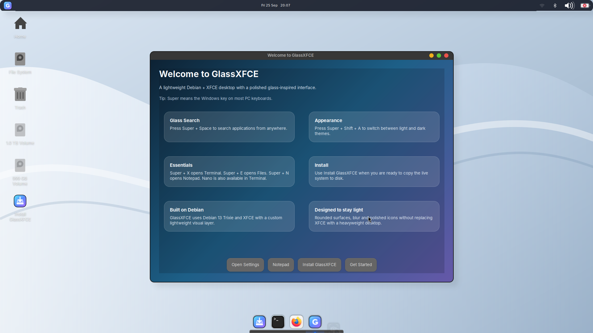
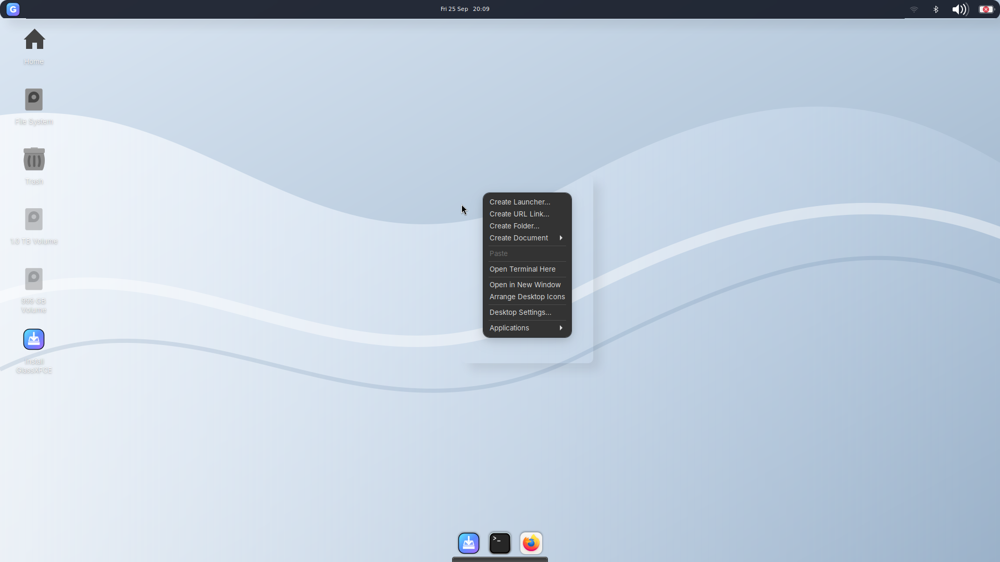
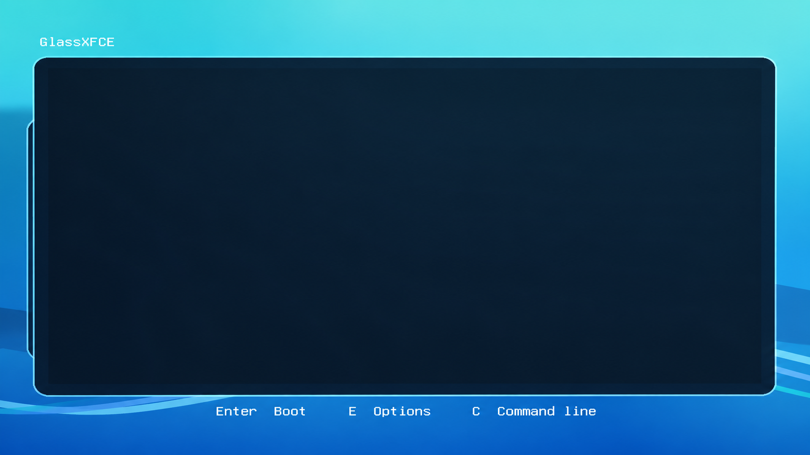
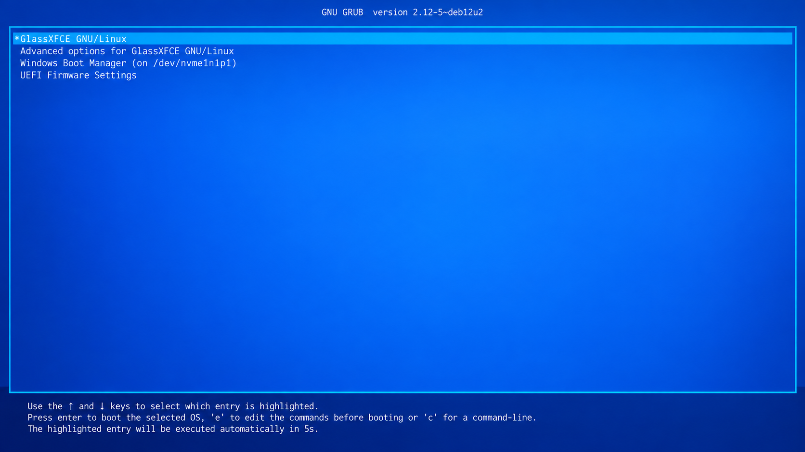
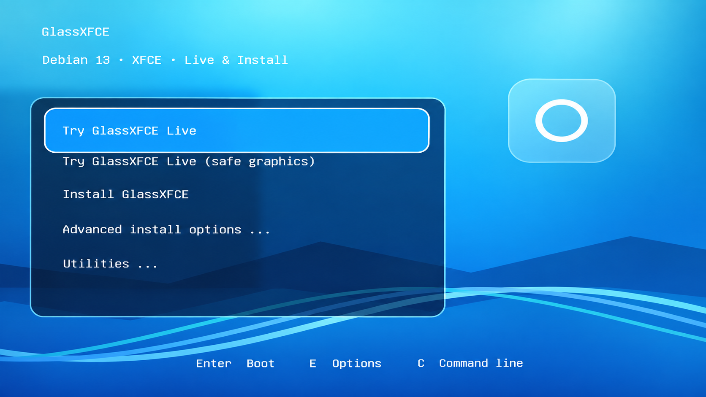

<div align="center">
  

# GlassXFCE

**A lightweight Debian 13 + XFCE live system with a modern glass-inspired desktop.**

[](#project-status)
[](https://www.debian.org/)
[](https://xfce.org/)
[](#technical-profile)
[](#technical-profile)

[](https://github.com/AhmadAddas/GlassXFCE/actions/workflows/validate.yml)
[](https://github.com/AhmadAddas/GlassXFCE/actions/workflows/build-iso.yml)
[](https://github.com/AhmadAddas/GlassXFCE/commits/main)
[](https://github.com/AhmadAddas/GlassXFCE/stargazers)
[](https://github.com/AhmadAddas/GlassXFCE/issues)

</div>

> [!CAUTION]
> **GlassXFCE is currently Canary / Work In Progress and is not ready for normal or production use.** Installer paths, boot transitions, compositor behavior, and UI polish still have known bugs. Test it on disposable hardware or in a VM and keep backups of any important data.

## Showcase

<div align="center">
  
  <br>
  <sub>Current Canary desktop: WhiteSur-inspired dark UI, bright Silver Wave wallpaper, GlassXFCE Welcome, top panel, and floating dock.</sub>
</div>

## What is GlassXFCE?

GlassXFCE is an experimental Debian 13 (Trixie) live distribution built around XFCE. The project aims to keep XFCE's low resource footprint while giving it a more cohesive modern desktop experience: glass surfaces, rounded windows, a floating dock, polished icons, a Spotlight-style launcher, a native Welcome app, branded boot visuals, and a live installer path.

The project intentionally stays close to Debian rather than replacing the base system with a large custom stack. Most of the visual layer is configuration, artwork, XFCE, Picom, Plank, Rofi, WhiteSur, and Papirus.

## Project status

**Channel:** `Canary`  
**Usability:** `Not ready for daily use`  
**Base:** Debian 13 / Trixie  
**Desktop:** XFCE  
**Primary architecture:** amd64  
**ISO target:** Live + installer hybrid image

The Canary channel is where boot behavior, installer integration, hardware coverage, theming, and first-login behavior are still being actively changed. A successful CI build does **not** mean the image is stable enough to install on a primary machine.

### Known Canary issues

| Area | Current issue |
| --- | --- |
| Live installer | **Install GlassXFCE** from the live desktop is currently not reliably working. |
| Installer flow | The install path can fall back to / expose the official Debian installer flow instead of a fully branded GlassXFCE setup experience. |
| Boot transitions | Black waiting/interstitial screens can still appear between boot stages or UI transitions. |
| Compositor/UI | Overlay, blur, or translucent-surface artifacts can still appear in some menus/windows. |
| UEFI install path | The UEFI installer path still has known boot/integration bugs. |
| Boot menu polish | Some themed GRUB menu elements still need spacing / overlay refinement. |

<details>
<summary><strong>Known-issue screenshots</strong></summary>

<br>

| Overlay / compositor artifact | Black waiting window |
| --- | --- |
|  |  |

| UEFI installer bug | Boot-menu overlay / pill UI issue |
| --- | --- |
|  |  |

</details>

## Highlights

- **Debian 13 Trixie base** with a standard Debian userspace and package ecosystem.
- **XFCE desktop** tuned for a lightweight runtime rather than a heavyweight shell.
- **Glass-inspired appearance** with WhiteSur GTK styling, Picom compositing, rounded surfaces, and custom GlassXFCE assets.
- **Floating Plank dock** plus a compact top panel.
- **Glass Search** powered by Rofi (`Super + Space`).
- **Native GTK Welcome app** instead of an HTML page in a browser.
- **Light / dark appearance switching** with a dark UI currently used as the default.
- **Bright GlassXFCE wallpapers** rather than Debian/XFCE stock wallpaper sets.
- **Broad icon coverage** using a GlassXFCE overlay with WhiteSur and Papirus fallbacks.
- **Live hardware coverage** for common Intel, AMD, NVIDIA/Nouveau, Wi-Fi, Bluetooth, audio, and firmware cases.
- **UEFI Secure Boot path** using Debian's signed boot components.
- **BIOS + UEFI hybrid ISO** with Live and installer menu entries.
- **Reproducible theme staging** using pinned upstream WhiteSur sources/releases.

## Keyboard shortcuts

| Shortcut | Action |
| --- | --- |
| `Super + Space` | Open **Glass Search** |
| `Super + X` | Open Terminal |
| `Super + E` | Open Files / Thunar |
| `Super + N` | Open Mousepad / Notepad |
| `Super + Shift + A` | Toggle light / dark appearance |
| `Print` | Full screenshot |
| `Shift + Print` | Region screenshot |

`Super` means the **Windows key** on most PC keyboards.

## Technical profile

| Component | Choice |
| --- | --- |
| Base | Debian 13 (Trixie) |
| Desktop | XFCE |
| Display stack | X.Org / X11 |
| Compositor | Picom |
| Dock | Plank |
| Launcher | Rofi, presented as Glass Search |
| File manager | Thunar |
| Terminal | xfce4-terminal |
| GUI editor | Mousepad |
| CLI editor | nano |
| Installer tooling | Calamares + Debian installer payload, currently Canary |
| Boot | GRUB EFI + Syslinux BIOS |
| Secure Boot | Debian signed UEFI boot path |
| Live filesystem | XZ-compressed SquashFS |
| ISO size budget | 1950 MiB |

### Hardware coverage

The live image explicitly carries the generic X.Org modesetting path, Mesa DRI/Vulkan, common video drivers, NetworkManager, WPA tooling, Bluetooth, PipeWire/Pulse compatibility, CPU microcode, and broad non-free firmware coverage for common Intel, AMD, NVIDIA/Nouveau, Realtek, Atheros, Broadcom, MediaTek/Ralink, Marvell/NXP, TI, and legacy USB wireless hardware.

This improves the odds of reaching usable graphics and networking on real hardware, but Canary images are still expected to encounter unsupported devices.

## Build from source

Clone the repository:

```bash
git clone https://github.com/AhmadAddas/GlassXFCE
cd GlassXFCE
```

GlassXFCE uses Debian `live-build`. On Debian 13, install the build dependencies used by `.github/workflows/build-iso.yml`, then run:

```bash
sudo VERSION=0.1.0 ./build.sh
```

Build output is written to `dist/` together with checksums and build metadata.

### GitHub Actions

Normal branch pushes and pull requests run lightweight validation only. They do **not** build or upload an ISO.

For a test ISO, use:

**Actions → Build ISO → Run workflow**

Tagged releases use semantic tags such as:

```bash
git tag v0.1.0
git push origin v0.1.0
```

The release workflow validates the ISO, installer payload, boot menu, image identity, checksums, package payload, Secure Boot files, SquashFS compression, and short QEMU BIOS/UEFI boot smoke tests before publication.

## Writing the ISO to USB

GlassXFCE is an ISO-hybrid image. Recommended raw-image writers include:

- Rufus **DD mode**
- Ventoy
- balenaEtcher
- `dd` on Linux/macOS

Rufus may ask to download matching GRUB/Syslinux helper files when using **ISO mode**. That is a Rufus compatibility prompt; see [`docs/usb-writing.md`](docs/usb-writing.md).

## Live session

The live desktop is intended to auto-login. If a greeter is shown during Canary testing, the fallback credentials are:

```text
username: live
password: live
```

The live image includes the GlassXFCE Welcome app and **Install GlassXFCE** launcher, but the installer remains a known Canary problem and should not currently be trusted for primary-system installation.

## Design and packaging notes

- APT Recommends are disabled to keep the image controlled and reproducible; required runtime pieces are therefore listed explicitly.
- WhiteSur GTK themes are staged from pinned upstream release material.
- WhiteSur remains the primary visual style while Papirus supplies broader icon fallback coverage.
- Picom is the compositor; Xfwm compositing is disabled to avoid running two compositors.
- The live root uses XZ SquashFS with a 1 MiB block size, full XZ dictionary, and x86 BCJ tuning.
- CI enforces a **1950 MiB** internal ISO ceiling to stay below GitHub's 2 GiB release-asset limit.
- Build cleanup removes caches and temporary data but deliberately protects GlassXFCE design assets, firmware, applications, and themes.

## Repository layout

```text
.github/workflows/     CI validation and ISO build/release workflows
assets/wallpapers/     Original GlassXFCE wallpaper sources/assets
auto/                  live-build configuration entry points
config/                Live image packages, hooks, bootloader and filesystem overlay
config/includes.chroot Files copied directly into the live filesystem
docs/                  Release, size, USB-writing and project documentation
scripts/               Build, validation, verification and smoke-test helpers
vendor/                Notes for externally sourced/pinned project components
```

## Contributing and testing

GlassXFCE is still in a phase where **real-hardware test reports are especially useful**. When reporting a bug, include the build commit, whether the machine booted via BIOS or UEFI, GPU/Wi-Fi hardware where relevant, and a photo or log of the failure.

Please check existing issues before opening a new report:

**https://github.com/AhmadAddas/GlassXFCE/issues**

## License

Licensing files are maintained separately from this README. GlassXFCE's original code/configuration and original artwork use different licenses, while bundled or staged third-party software keeps its upstream license.

---

<div align="center">
  <strong>GlassXFCE Canary</strong><br>
  Lightweight underneath. Glass on top. Still under construction.
</div>
